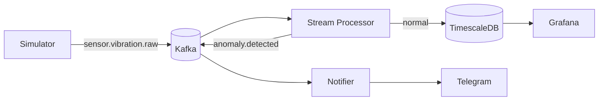

# 01 — Mimari Yaklaşım: Event-Driven Servis Mimarisi

**Terminoloji:** Bu proje **tam mikroservis değil**, **event-driven / gevşek bağlı servis mimarisi**dir.

| Mikroservis kriteri | Durum |
|---|---|
| Ayrı process/container | ✅ |
| Asenkron mesajlaşma (broker) | ✅ (Kafka) |
| Database-per-service | ❌ (tek TimescaleDB) |
| API Gateway / Service Discovery | ❌ |
| Bağımsız deploy döngüsü | ❌ |

**Gerekçe:** Tek kişilik/3 haftalık projede database-per-service ve API gateway, bağımsız takım/deploy döngüsü olmadan fayda getirmeden karmaşıklık artırır.

## Veri Akışı

**Kilit karar:** Servisler birbirini doğrudan çağırmaz. Anomali bulunduğunda Telegram doğrudan tetiklenmez; `anomaly.detected` event'i Kafka'ya yazılır, Notifier tüketir. Böylece yeni bir bildirim kanalı veya analiz servisi, mevcut servislere dokunmadan yalnızca yeni bir consumer eklenerek entegre edilir. (Mimari seviyede Open/Closed.)

## Kullanılmayan Desenler (Bilinçli Karar)

| Desen | Neden kullanılmadı |
|---|---|
| **Saga** | Çok servisli, kendi DB'li, geri alınabilir iş akışları için. Bizde tek DB, tek yönlü akış |
| **Circuit Breaker (genel)** | Asenkron iletişim, kaskad çökme riski yok. Tek istisna Telegram çağrısı (`pybreaker`) |
| **CQRS** | TimescaleDB continuous aggregate zaten okuma optimizasyonunu event sourcing olmadan sağlıyor |

## Topic, Partition ve Servis Sayıları

### Kafka Topic'leri

| Topic | Partition | Üreten (producer) | Tüketen (consumer) | Gerekçe |
|---|---|---|---|---|
| `sensor.vibration.raw` | **4** | simulator | stream-processor | 1 partition = 1 rulman (`bearing_1..4`); `machine_id` ile anahtarlanır |
| `sensor.vibration.features` | 2 | stream-processor | (opsiyonel analizciler) | Özellik akışı; ağır throughput yok |
| `anomaly.detected` | 2 | stream-processor | notifier | Anomali seyrek olay, yüksek throughput gerekmez |
| `anomaly.dlq` | 1 | stream-processor, notifier | (manuel inceleme) | Ölü mektup kuyruğu; düşük hacim (bkz. 07) |

**Kritik:** `sensor.vibration.raw` partition anahtarı `machine_id`'dir (`snapshot_id` DEĞİL) — chunk reassembly'nin tek instance'ta çalışması için (bkz. 03, ADR-0004).

### Servisler: Rol ve Instance Sayısı

| Servis | Producer | Consumer | Instance (başlangıç → ölçek) |
|---|---|---|---|
| simulator | ✅ | — | 1 |
| stream-processor | ✅ | ✅ | 1 → 4 (partition sayısı kadar paralel) |
| notifier | (yalnız DLQ) | ✅ | 1 (idempotency/çift bildirim önleme için tekil) |

**Özet:** 2 ana producer rolü (simulator, stream-processor), 2 ana consumer rolü (stream-processor, notifier). Stream-processor hem tüketir hem üretir — bu yüzden "stream processor"dır.

**Ölçeklenme mantığı:** `sensor.vibration.raw` 4 partition olduğu için, stream-processor consumer group'una en fazla 4 aktif instance eklenebilir; her biri bir rulmanı işler. 4'ten fazla instance boşta bekler (Kafka kuralı). Detay: 08-nfr-sla.
