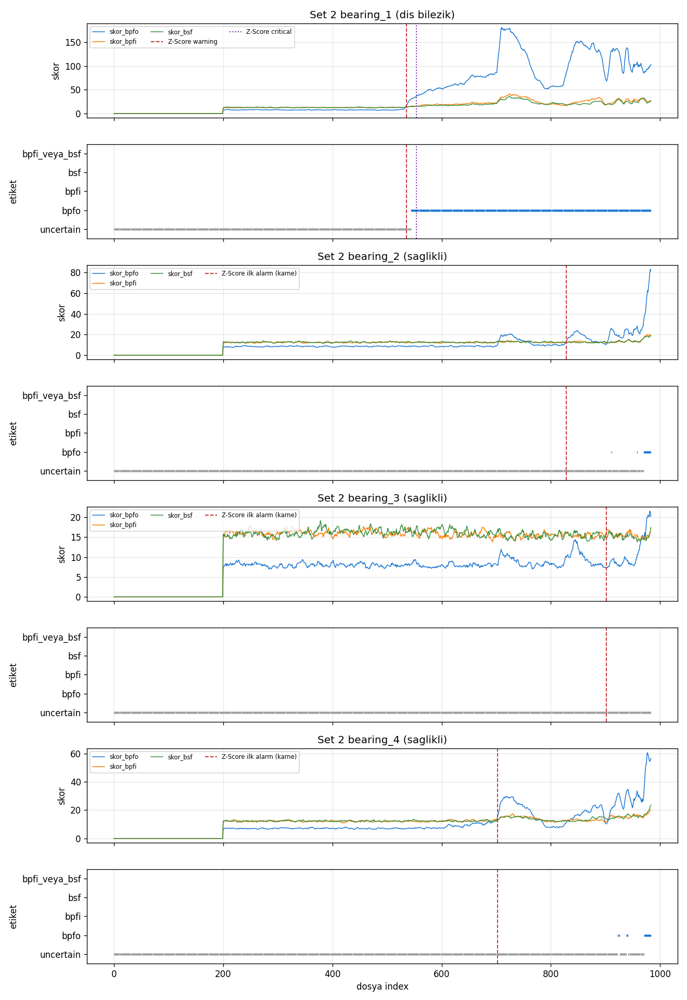
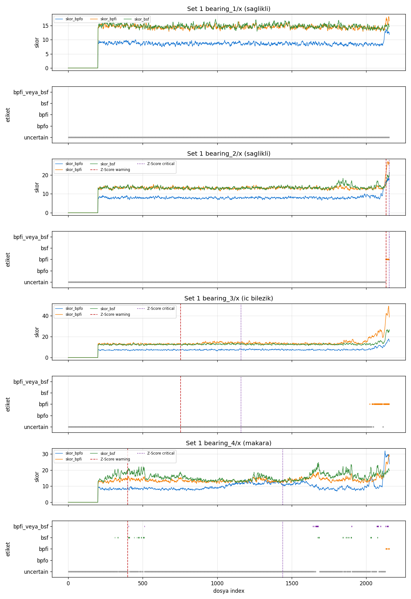
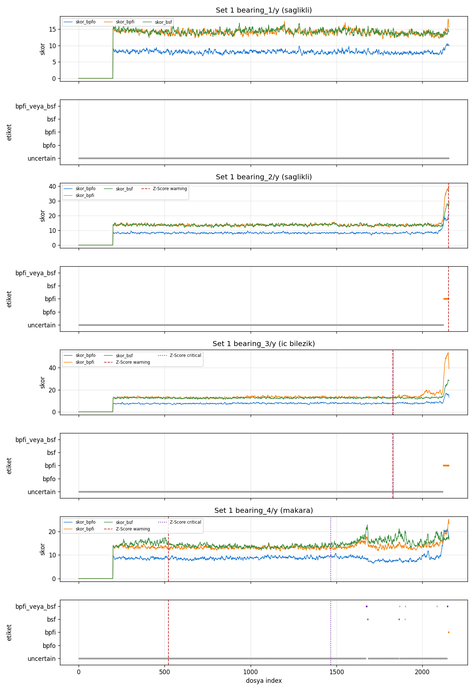

# IMS envelope tepe-belirginligi teshisi (ADR-0015, offline)

Canli `fault_type` yok. Z-Score/IF/esik degismez. Mutlak enerji yok.
ADR-0015 **kapandi**: yanlis etiket dustu; teshis edilebilirlik ve
alarm-capali pencere bu Set 1/Set 2 ciftinde calismadi.
Kayma ±2%, gurultu tabani ±50 Hz medyan, k=1..5, spektral ortalama 8, Hann.
Esik **Set 2 orta pencere**: min_score=20, bpfo_margin=2, inner_margin=1.3. Set 1'e retune yok.

bpfi_veya_bsf: beklenen bpfi/bsf ise belirsiz (yanlis degil); beklenen bpfo veya saglikli ise yanlis.

## Kinematik (ZA-2115, 2000 rpm, kod yazilmadan onceki hesap)

n=16, d=0.331 in, D=2.815 in, alpha=15.17 deg, fr=2000/60 Hz.
BPFO=236.40 Hz, BPFI=296.93 Hz, BSF=139.92 Hz, 2xBSF=279.83 Hz, FTF=14.78 Hz.
ADR-0010 `CHARACTERISTIC_HZ`: bpfo=236.0, bpfi=297.0, bsf=278.0.
**278 Hz = 2xBSF** (rel 0.66%); temel BSF ~140 Hz. Enerji kovasi 1.+2.+3. H * 278 -> ~2x,4x,6x BSF; tek sayili BSF harmonikleri o kovada yok. Kovalar **degistirilmedi** (canli fft_band_energy / mevcut testler). Teshis 2xBSF + FTF yan bant kullanir.

## Set 2 kalibrasyon (b1=bpfo, b2/3/4=uncertain)

984 dosya. Orta pencere esik secimi; erken/gec rapor.

### Set 2

#### erken (index 200..461)

| Rulman | NASA | beklenen | n | dogru | yanlis | belirsiz | belirsiz % |
|---|---|---|---:|---:|---:|---:|---|
| bearing_1 | dis bilezik | bpfo | 261 | 0 | 0 | 261 | 100.0% |
| bearing_2 | saglikli | uncertain | 261 | 261 | 0 | 0 | 0.0% |
| bearing_3 | saglikli | uncertain | 261 | 261 | 0 | 0 | 0.0% |
| bearing_4 | saglikli | uncertain | 261 | 261 | 0 | 0 | 0.0% |

#### orta (index 461..722)

| Rulman | NASA | beklenen | n | dogru | yanlis | belirsiz | belirsiz % |
|---|---|---|---:|---:|---:|---:|---|
| bearing_1 | dis bilezik | bpfo | 261 | 178 | 0 | 83 | 31.8% |
| bearing_2 | saglikli | uncertain | 261 | 261 | 0 | 0 | 0.0% |
| bearing_3 | saglikli | uncertain | 261 | 261 | 0 | 0 | 0.0% |
| bearing_4 | saglikli | uncertain | 261 | 261 | 0 | 0 | 0.0% |

#### gec (index 722..984)

| Rulman | NASA | beklenen | n | dogru | yanlis | belirsiz | belirsiz % |
|---|---|---|---:|---:|---:|---:|---|
| bearing_1 | dis bilezik | bpfo | 262 | 262 | 0 | 0 | 0.0% |
| bearing_2 | saglikli | uncertain | 262 | 246 | 16 | 0 | 0.0% |
| bearing_3 | saglikli | uncertain | 262 | 262 | 0 | 0 | 0.0% |
| bearing_4 | saglikli | uncertain | 262 | 243 | 19 | 0 | 0.0% |

## Set 1 hold-out (esik kilit)

2156 dosya. NASA: b3 ic bilezik, b4 bilye, b1/b2 saglikli.

### Set 1 X

#### erken (index 200..852)

| Rulman | NASA | beklenen | n | dogru | yanlis | belirsiz | belirsiz % |
|---|---|---|---:|---:|---:|---:|---|
| bearing_1 | saglikli | uncertain | 652 | 652 | 0 | 0 | 0.0% |
| bearing_2 | saglikli | uncertain | 652 | 652 | 0 | 0 | 0.0% |
| bearing_3 | ic bilezik | bpfi | 652 | 0 | 0 | 652 | 100.0% |
| bearing_4 | makara | bsf | 652 | 29 | 0 | 623 | 95.6% |

#### orta (index 852..1504)

| Rulman | NASA | beklenen | n | dogru | yanlis | belirsiz | belirsiz % |
|---|---|---|---:|---:|---:|---:|---|
| bearing_1 | saglikli | uncertain | 652 | 652 | 0 | 0 | 0.0% |
| bearing_2 | saglikli | uncertain | 652 | 652 | 0 | 0 | 0.0% |
| bearing_3 | ic bilezik | bpfi | 652 | 0 | 0 | 652 | 100.0% |
| bearing_4 | makara | bsf | 652 | 0 | 0 | 652 | 100.0% |

#### gec (index 1504..2156)

| Rulman | NASA | beklenen | n | dogru | yanlis | belirsiz | belirsiz % |
|---|---|---|---:|---:|---:|---:|---|
| bearing_1 | saglikli | uncertain | 652 | 652 | 0 | 0 | 0.0% |
| bearing_2 | saglikli | uncertain | 652 | 626 | 26 | 0 | 0.0% |
| bearing_3 | ic bilezik | bpfi | 652 | 110 | 0 | 542 | 83.1% |
| bearing_4 | makara | bsf | 652 | 31 | 16 | 605 | 92.8% |

### Set 1 Y

#### erken (index 200..852)

| Rulman | NASA | beklenen | n | dogru | yanlis | belirsiz | belirsiz % |
|---|---|---|---:|---:|---:|---:|---|
| bearing_1 | saglikli | uncertain | 652 | 652 | 0 | 0 | 0.0% |
| bearing_2 | saglikli | uncertain | 652 | 652 | 0 | 0 | 0.0% |
| bearing_3 | ic bilezik | bpfi | 652 | 0 | 0 | 652 | 100.0% |
| bearing_4 | makara | bsf | 652 | 0 | 0 | 652 | 100.0% |

#### orta (index 852..1504)

| Rulman | NASA | beklenen | n | dogru | yanlis | belirsiz | belirsiz % |
|---|---|---|---:|---:|---:|---:|---|
| bearing_1 | saglikli | uncertain | 652 | 652 | 0 | 0 | 0.0% |
| bearing_2 | saglikli | uncertain | 652 | 652 | 0 | 0 | 0.0% |
| bearing_3 | ic bilezik | bpfi | 652 | 0 | 0 | 652 | 100.0% |
| bearing_4 | makara | bsf | 652 | 0 | 0 | 652 | 100.0% |

#### gec (index 1504..2156)

| Rulman | NASA | beklenen | n | dogru | yanlis | belirsiz | belirsiz % |
|---|---|---|---:|---:|---:|---:|---|
| bearing_1 | saglikli | uncertain | 652 | 652 | 0 | 0 | 0.0% |
| bearing_2 | saglikli | uncertain | 652 | 619 | 33 | 0 | 0.0% |
| bearing_3 | ic bilezik | bpfi | 652 | 36 | 0 | 616 | 94.5% |
| bearing_4 | makara | bsf | 652 | 10 | 7 | 635 | 97.4% |

### Hold-out ozeti (esik kilit, Set 1'e uydurma yok)

Orta pencere protokolun ana olcusu (gec spektrum genis bantlasir).

| Eksen | pencere | dogru | yanlis | belirsiz | sagliklida yanlis |
|---|---|---:|---:|---:|---:|
| X | erken | 1333 | 0 | 1275 | 0 |
| X | orta | 1304 | 0 | 1304 | 0 |
| X | gec | 1419 | 42 | 1147 | 26 |
| Y | erken | 1304 | 0 | 1304 | 0 |
| Y | orta | 1304 | 0 | 1304 | 0 |
| Y | gec | 1317 | 40 | 1251 | 33 |

Set 1 X orta 4/4 analogu: **tutmadi**. Y: **tutmadi**.

## Enerji tabanli karne ile (ims_set1_envelope_diagnosis.md)

Onceki kural tek etiket/rulman (AND + z + enerji orani, C=25). Bu kural snapshot basina tepe belirginligi + erken/orta/gec. Sutunlar birebir degil; yanlis vs belirsiz burada ayri sayilir.

| Kaynak | Set 1 X b1 | b2 | b3 (ic) | b4 (bilye) | 4/4 |
|---|---|---|---|---|---|
| Enerji+z C=25 | uncertain ok | **bpfo yanlis** | uncertain (hedef yok) | **bpfo yanlis** | tutmadi |
| Belirginlik (orta, asagida) | d=652 y=0 b=0 | d=652 y=0 b=0 | d=0 y=0 b=652 | d=0 y=0 b=652 | tutmadi |

Esik Set 1'e kaydirilmadi. Tutmazsa gevsetme / sinif birlestirme yok.

## Yorum

Set 2 orta: b1 BPFO 178/261 dogru, sagliklida yanlis=0 (kalibrasyon hedefi). Set 2 gec saglikli kirildi: b2 yanlis=16, b4 yanlis=19 — esik buna gore kaydirilmadi (protokol orta pencere).

Set 1 orta X (hold-out): b3 dogru=0 yanlis=0 belirsiz=652; b4 dogru=0 yanlis=0 belirsiz=652. Saglikli orta: yanlis yok. 4/4 analogu tutmadi / Y tutmadi.

Set 1 gec X'te imza gecikir: b3 dogru=110, b4 dogru=31 ama yanlis=16; b2 sagliklida yanlis=26. Gec pencere ayirt edicilik kaybeder; protokol orta olcuyu kilitler.

Enerji karnesine gore: belirginlik saglikli orta pencerede false BPFO uretmedi (enerji C=25 b2/b4'u BPFO yapmisti). Ic bilezik/bilye yine orta evrede ayrilmadi. Esik gevsetilmedi, sinif birlestirilmedi.

- Teshis zorlanmadi (`uncertain` / `bpfi_veya_bsf` serbest).
- Yanlis etiket belirsizden pahali.
- Canli boru, fault_type, ADR-0006/0008, detectors/ml_detectors yok.

## Gorunurluk (esik/pencere kilit; olcum)

Z-Score cizgileri mevcut karnelerden (yeniden hesap yok):
`ims_set2_zscore_calibration.md` 5.0/8.0, `ims_set1_zscore.md`.
Set 2 b2/b3/b4 karnede yalniz ilk alarm; critical yok.
Set 1'e bakarak pencere/esik secilmedi.

### Arizali kanal: dogru etiket araligi vs Z-Score

| Kanal | beklenen | dogru etiket araligi | Z-Score W | Z-Score C | W minmax? | C minmax? | W ada ici? | C ada ici? | etiket(W) | etiket(C) |
|---|---|---|---:|---:|---|---|---|---|---|---|
| set2 bearing_1 | bpfo | 544-983 (n=440) | 536 | 554 | hayir (W/C=536, minmax 544-983) | evet (W/C=554, minmax 544-983) | hayir (adalarda yok) | evet | uncertain | bpfo |
| set1 bearing_3/x | bpfi | 2023-2155 (7 ada: 2023, 2025, 2038-2042, 2044-2045, 2048, 2051-2109, 2115-2155; n=110) | 755 | 1159 | hayir (W/C=755, minmax 2023-2155) | hayir (W/C=1159, minmax 2023-2155) | hayir (adalarda yok) | hayir (adalarda yok) | uncertain | uncertain |
| set1 bearing_3/y | bpfi | 2120-2155 (n=36) | 1829 | 1830 | hayir (W/C=1829, minmax 2120-2155) | hayir (W/C=1830, minmax 2120-2155) | hayir (adalarda yok) | hayir (adalarda yok) | uncertain | uncertain |
| set1 bearing_4/x | bsf | 314-2076 (23 ada: 314, 333-335, 403-404, 406-407, 410-412, 443, 462, 471, 473-476, 489-492, ... +13 ada; n=60) | 399 | 1440 | evet (W/C=399, minmax 314-2076) | evet (W/C=1440, minmax 314-2076) | hayir (adalarda yok) | hayir (adalarda yok) | uncertain | uncertain |
| set1 bearing_4/y | bsf | 1679-1899 (4 ada: 1679-1683, 1862, 1864-1866, 1899; n=10) | 523 | 1467 | hayir (W/C=523, minmax 1679-1899) | hayir (W/C=1467, minmax 1679-1899) | hayir (adalarda yok) | hayir (adalarda yok) | uncertain | uncertain |

### Sorunun cevabi (olcum; kural degismez)

- **set2 bearing_1** bpfo etiketleri 544-983 (n=440, 1 ada). Z-Score warning 536: minmax hayir (W/C=536, minmax 544-983), ada ici hayir (adalarda yok), o index'te `uncertain`. critical 554: minmax evet (W/C=554, minmax 544-983), ada ici evet, o index'te `bpfo`.
- **set1 bearing_3/x** bpfi etiketleri 2023-2155 (n=110, 7 ada). Z-Score warning 755: minmax hayir (W/C=755, minmax 2023-2155), ada ici hayir (adalarda yok), o index'te `uncertain`. critical 1159: minmax hayir (W/C=1159, minmax 2023-2155), ada ici hayir (adalarda yok), o index'te `uncertain`.
- **set1 bearing_3/y** bpfi etiketleri 2120-2155 (n=36, 1 ada). Z-Score warning 1829: minmax hayir (W/C=1829, minmax 2120-2155), ada ici hayir (adalarda yok), o index'te `uncertain`. critical 1830: minmax hayir (W/C=1830, minmax 2120-2155), ada ici hayir (adalarda yok), o index'te `uncertain`.
- **set1 bearing_4/x** bsf etiketleri 314-2076 (n=60, 23 ada). Z-Score warning 399: minmax evet (W/C=399, minmax 314-2076), ada ici hayir (adalarda yok), o index'te `uncertain`. critical 1440: minmax evet (W/C=1440, minmax 314-2076), ada ici hayir (adalarda yok), o index'te `uncertain`.
- **set1 bearing_4/y** bsf etiketleri 1679-1899 (n=10, 4 ada). Z-Score warning 523: minmax hayir (W/C=523, minmax 1679-1899), ada ici hayir (adalarda yok), o index'te `uncertain`. critical 1467: minmax hayir (W/C=1467, minmax 1679-1899), ada ici hayir (adalarda yok), o index'te `uncertain`.

